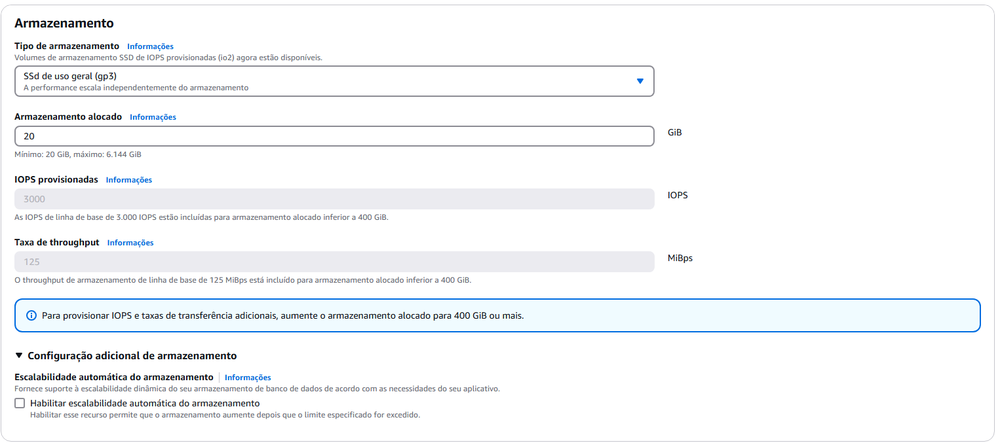

# aws-infra-atividade

Atividade para conexão de uma instância EC2 a partir de um SSH client.

- Criação do key par:

- Criando security group

- Criando Instância EC2

- Criando SG para o bd

- Criação do banco de dados PostgresSQL

